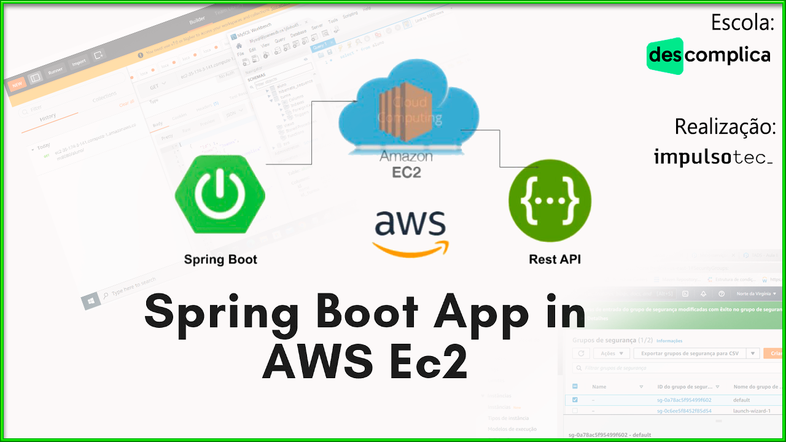
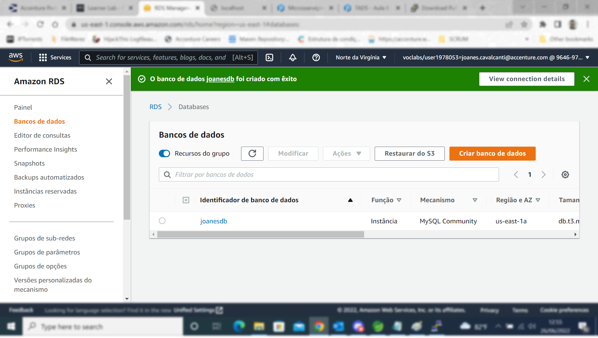

**Aluno:** Joanes Cavalcanti de Araújo 

**Prof:** Marcelo Estruc e Moisés André

**Turma:** Back-End
   

**Atividade prática do projeto:**

Subindo uma aplicação **Springboot** para uma máquina da AWS.

- Criar instância do     EC2.
- Criando uma máquina na     AWS. Ubuntu Server 22.04 LTS (... *criar par de chaves*, *chave pem*).
- No EC2, editar regras     de entrada pelo **grupo de segurança** para poder liberar acesso ao     banco de dados de fora da máquina, pela máquina local, acessar a máquina     no AWS. Liberando **PORTAS**. *SSH, HTTP, Mysql/Aurora, TCP     Personalizado.*
- Utilizar o **PuTTy     Key Generator** para converter a chame pem em ppk
- Criar o banco de dados     MySql no lab da AWS, configurar *credenciais, acesso público...*
- Depois em **Segurança     e conexão** vamos pegar o *endpoint* e a *porta* para conectar     no database do mysql local.
- Configurar a conexão     do SpringBoot para o MySql no: *aplication.properties*
- Executar o Maven     install do seu projeto para gerar um arquivo **.jar** e seguinda enviar     para AWS através do WinSCP
- No PuTTy , dentro da     máquina da AWS com o arquivo **.jar** na raiz, levantamos a APLICAÇÃO.
- Por fim, usamos o **POSTMAN**     para testar nossa aplicação, pegando o endereço da máquina na instância do     EC2 usando DNS público.

**OBS:** Lembrando que depois da conexão com o Mysql é necessário liberar o acesso externo ao banco.

## Screens:

